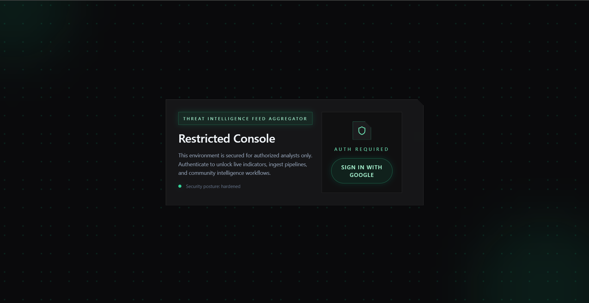
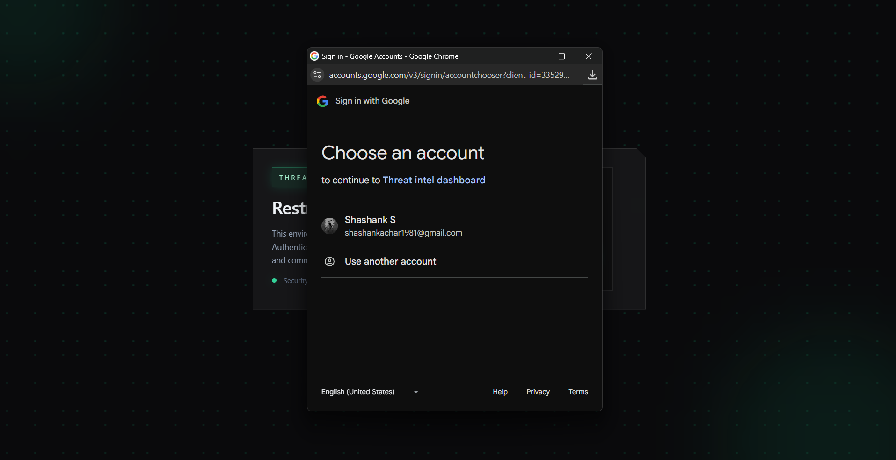
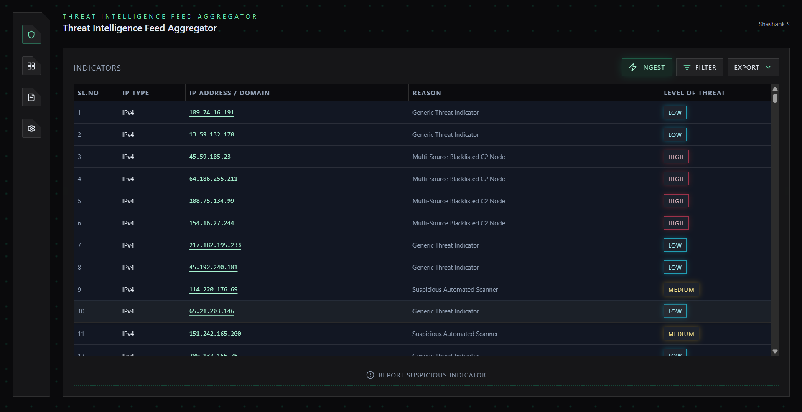
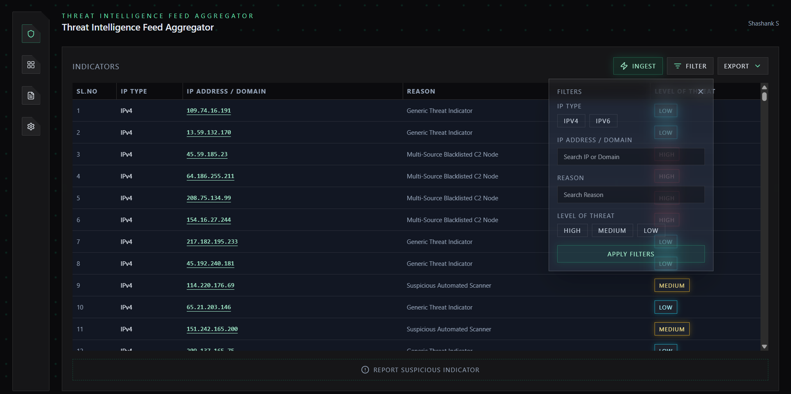
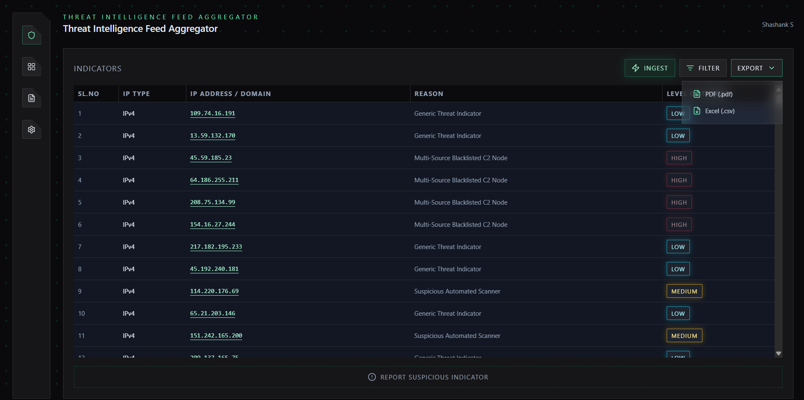
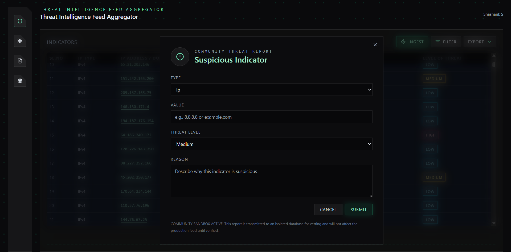
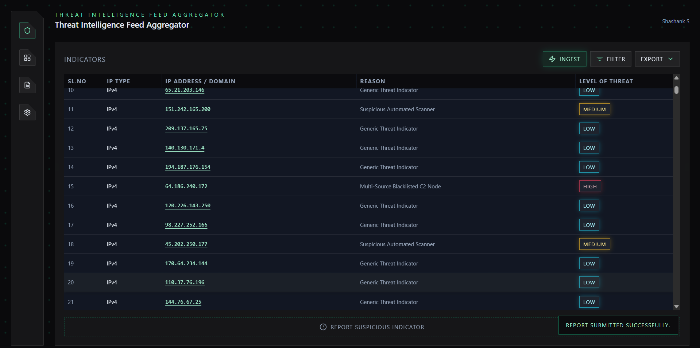
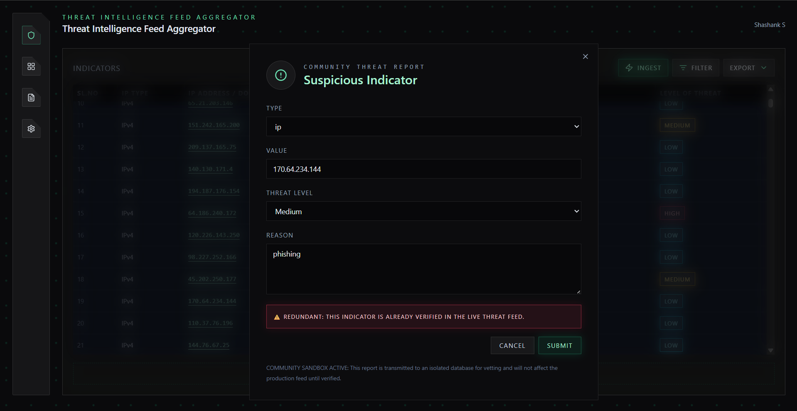

# Cyber-Grid Operations: Enterprise Threat Intelligence Platform

A full-stack cybersecurity application that aggregates, vets, and exports Indicators of Compromise (IoCs) using a Zero-Trust Sandbox architecture to prevent database poisoning from untrusted community reports.

## Problem Statement

Threat intelligence platforms often ingest community-submitted indicators. Without strict isolation and validation, malicious or low-quality submissions can poison the production database. This undermines trust, reduces signal quality, and can cause downstream security systems to block legitimate assets.

## Our Solution and Architecture

This project implements a dual-database, Zero-Trust Sandbox architecture:

- Production database stores verified indicators used by the live threat feed.
- Sandbox database stores community reports in quarantine.
- Cross-database redundancy checks prevent duplicates from entering the sandbox and block indicators that already exist in production.
- Only vetted records are promoted to production.

This design preserves data integrity, improves reliability, and mitigates database poisoning risks.

## User Interface and Workflows

### Login Interface



### Google OAuth Flow



### Main Intelligence Dashboard



### Advanced Filtering



### Data Export (PDF/CSV)



### Community Reporting Form



### Successful Submission Validation



### Redundant Data Protection Alert



## Tech Stack

- Frontend: React.js (Vite), Tailwind CSS
- Backend: Python, FastAPI
- Database: MongoDB Atlas (Dual-Database Architecture: Production and Sandbox)

## Key Features

- Real-time threat aggregation and data ingestion
- Dual-database sandbox that isolates community reports from production
- Advanced validation with cross-database redundancy checks
- Threat intelligence export with PDF and CSV downloads
- Advanced filtering by IP type, threat level, and reason
- Secure authentication via Google OAuth

## Local Setup Instructions

### 1. Clone the repository

```bash
git clone <YOUR_REPOSITORY_URL>
cd hackathon
```

### 2. Backend setup (FastAPI)

```bash
python -m venv .venv

# Windows PowerShell
.\.venv\Scripts\Activate.ps1

# macOS/Linux
# source .venv/bin/activate

pip install -r requirements.txt
```

Create a `.env` file in the project root with your MongoDB connection string:

```
MONGODB_URI="mongodb+srv://<username>:<password>@<cluster>/<db>?retryWrites=true&w=majority"
```

Start the backend server:

```bash
python main.py
```

The API will be available at:

```
http://localhost:8000
```

### 3. Frontend setup (Vite + React)

```bash
cd frontend
npm install
```

Create `frontend/.env` with your Google OAuth Client ID:

```
VITE_GOOGLE_CLIENT_ID=<YOUR_GOOGLE_CLIENT_ID>
```

Start the frontend:

```bash
npm run dev
```

The UI will be available at:

```
http://localhost:5173
```

## Notes for Evaluators

- The Sandbox database stores community reports with a quarantined status.
- Duplicate checks block indicators already verified in production and prevent repeat reports in the sandbox.
- Export tools support PDF and CSV for professional reporting.
